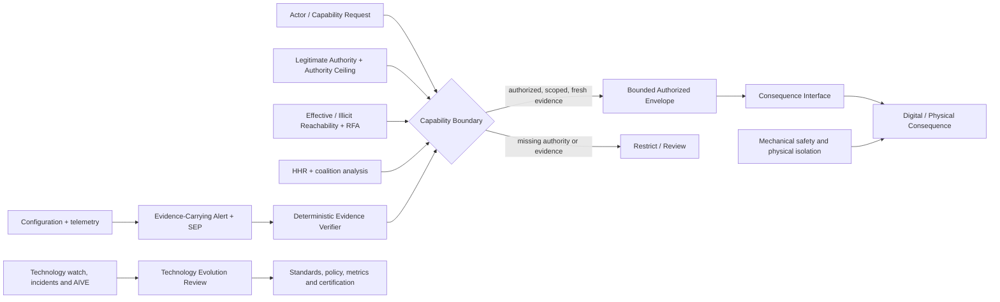

# Universal AI Safety Architecture (UAIS) — Master Index

Status: **Pre-standard research architecture — Draft 1.0 Candidate 2 / Public Review**

Core public slogan: **Assume unlimited intelligence. Limit autonomous authority.**  
Configuration date: 2026-08-25

## Executive summary

UAIS constrains consequential power rather than intelligence labels. It separates capability, legitimate permission, effective reachability and human consequence; places target-side gates at consequence interfaces; preserves independent physical and human control; treats protected authority expansion as a governed safety event; and evolves evidence, standards and certification with capability and environment.

The architecture is deliberately bounded. It does not claim complete hazard discovery, universal observability, perfect Guardian reasoning, exact physical-sovereignty measurement, universally enforceable offline replication budgets or software control of a hostile physically independent system.

## Architecture

Candidate 2 is a corrective public-review baseline. It aligns the public architecture diagram with the canonical Capability Boundary / Consequence Interface model, restores Structured Evidence Package semantics for SEP, and closes remaining Trustworthiness Status / Rating separation issues.

## Reading order

1. [Manifesto](01_MANIFESTO.md) and [Canonical Threat Model](02_THREAT_MODEL.md)
2. [Normative Vocabulary](03_NORMATIVE_VOCABULARY.md) and [Global Name Registry](GLOBAL_NAME_REGISTRY.md)
3. [Classification](04_CLASSIFICATION_MODEL.md), [Metric Registry](05_SAFETY_METRICS.md) and [Assurance](06_SAFETY_ASSURANCE_MODEL.md)
4. [Hazard Disclosure and Safety Passport](07_HAZARD_DISCLOSURE_AND_SAFETY_PASSPORT.md)
5. [Authority Architecture](08_CAPABILITY_AUTHORITY_ARCHITECTURE.md), [Guardian](09_GUARDIAN_ARCHITECTURE.md) and [Physical Safety](10_PHYSICAL_SAFETY_AND_HUMAN_SOVEREIGNTY.md)
6. [Replication and Production](11_REPLICATION_PRODUCTION_AND_EXPANSION.md) and [Stage II](12_STAGE_II_PHYSICAL_SOVEREIGNTY.md)
7. [Lifecycle](13_DEVICE_LIFECYCLE_AND_UPDATES.md), [Governance](14_SAFETY_CONSTITUTION_AND_GOVERNANCE.md) and [Safety Management System](15_UAIS_SAFETY_MANAGEMENT_SYSTEM.md)
8. [Protocols](16_PROTOCOLS.md), [Standards Family](17_UAIS_STANDARDS_FAMILY.md) and [Standards Crosswalk](STANDARDS_CROSSWALK.md)
9. [Certification](18_CERTIFICATION_AND_LIABILITY.md), [AIVE](19_AIVE.md) and [Evolution](20_EVOLUTION_AND_EXTENSIBILITY.md)
10. [Application Profiles](21_USE_CASES.md), [Prior Art](22_PRIOR_ART_AND_NOVELTY.md), [Open Research](23_OPEN_RESEARCH_PROBLEMS.md) and [Roadmap](26_IMPLEMENTATION_AND_RESEARCH_ROADMAP.md)

## Stage comparison

| Dimension | Stage I | Stage II |
|---|---|---|
| Compute provenance | useful but bypassable control point | unreliable as a foundation |
| Primary value | friction, warning, investigation and time | consequence-interface and physical-dependency resilience |
| Signals | accelerators, supply chain, cloud/data center, workload attestation, aggregate effective compute, energy/cooling | authority/consequence paths, coalition scale, resources/production, dependency substitution and Physical Sovereignty Margin |
| Core engineering | build Stage II-capable gates, physical controls, evidence and governance | operate them under lost chokepoints and approaching sovereignty |
| Honest limit | incomplete detection | hostile independent physically sovereign autonomous systems cannot be coerced by internal policy |

## Status language

- **NORMATIVE DRAFT:** SHALL/SHOULD/MAY requirement for the proposed specification.
- **ADAPTED:** established mechanism adapted to UAIS.
- **PROPOSED:** design requiring standardization and validation.
- **OPEN RESEARCH:** unresolved mechanism with bounded interim control.
- **INFORMATIVE:** explanation, example or crosswalk without conformance force.

## Critical open issues

Formal reachable-authority bounds; coalition composition; Guardian common-mode verification; machine-speed legitimacy; offline replication control; Physical Sovereignty Threshold and Margin measurement; distributed sovereignty; hostile post-threshold containment; privacy-preserving attestation; international interoperability; metric calibration and gaming; sector mappings; and complete prior-art review. They remain bounded claims and do not constitute solved research problems.

## AI Trustworthiness and Error Evidence layer

The candidate includes domain-scoped profiles, validated error reporting, independent evaluation, operational denominators, hard-cap rating logic, three protocols, a mandatory UAIS-1700 extension practice, and proposed UAIS-1700. Core UAIS SMS remains 23 practices; UAIS-1700 conformance adds one Trustworthiness extension practice. Trustworthiness is neither Safety Assurance Level nor authority.
